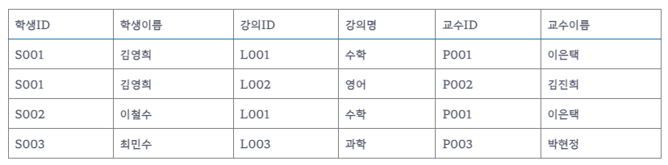

### 정규화와 반정규화란 무엇인가

- 1정규화 [제 1 정규형을 만족하는 테이블]
```text
하나의 컬럼에는 하나의 데이터만 사용한다
```

<회원 테이블>

| 아이디 | 이름  | 취미                |
|-----|-----|-------------------|
| 1   | 유호연 | 클라이밍,스키,보드        |
| 2   | 홍지운 | 클라이밍, 위스키시음, 코딩공부 |
| 3   | 김종구 | 클라이밍, 마라톤         |

문제점
1. 클라이밍과 같은 데이터 중복이 발생할 수 있다.
2. 갱신 이상 -> 유호연의 취미가 수영으로 바뀔 경우 클라이밍 스키 보드 정보가 유실 될 수 있다. 
3. 삭제 이상 -> 유호연이 더이상 스키를 안할 경우 클라이밍과 보드의 정보가 유실될 수 있다.

1 정규형을 만족하는 테이블

<회원 테이블>

| 아이디 | 이름  | 취미    |
|-----|-----|-------|
| 1   | 유호연 | 클라이밍  |   
| 2   | 유호연 | 스키    |   
| 3   | 유호연 | 보드    |   
| 4   | 홍지운 | 클라이밍  |
| 5   | 홍지운 | 위스키시음 |
 ...

- 2정규화
```text
1. 현재 테이블의 주제와 관련 없는 컬럼을 다른테이블로 빼는 작업
2. Partial dependency 를 제거하는 작업 입니다.
```

<회원 테이블>

| 아이디 | 이름  | 상품코드 | 가격  |   
|-----|-----|------|-----|
| 1   | 유호연 | S100 | 200 |
| 2   | 유호연 | S200 | 300 |
| 3   | 유호연 | S300 | 400 |
| 4   | 홍지운 | S400 | 500 |
| 5   | 홍지운 | S500 | 600 |

위와같이 하나의 테이블에 상품 정보 내역등이 있어 중복이 발생하고 무결성이 유지되지 않는다.
S100 이 2000원으로 바뀌었을 경우 다른 상품코드의 가격변동이 모호해진다.

- 3정규화
```text
제 2 정규화를 완료한 테이블에서 이행적 함수 종속성을 제거하는것.
```


위 테이블에서 학생 ID 는 학생 이름에 종속되며 강의명은 강의 ID 에 종속된다.<br>
이러한 이행 종속성 때문에 중복 데이터와 무결성 문제가 발생할 수 있다

이를 해결해기 위해서는 학생테이블, 강의 테이블, 교슈 테이블, 수강신청 테이블로 그 역할을 분리할 수 있다.

Q. DB 정규화와 반정규화란 무엇인가

디비 정규화란 데이터베이스 설계에서 중복을 최소화 하기 위해 데이터를 구조화 하는 프로세스를 디비 정규화 라고 하며
<br>
반정규화는 데이터 중복을 고의로 일으켜 성능을 향상시키기 위한 기법입니다. 데이터 조회시 디스크 I/O 량이 많거나
Join 경로가 너무 멀어 성능저하가 예상되는 컬럼이 있는 경우 반정규화를 수행하게 됩니다.

디비 정규화 과정은 1정규화 2정구화 3정규화로 나뉘어지며
공통적인 특징으로는 하나의 컬럼이 여러 정보를 갖지 않게 하며 테이블 목적에 맞지 않은 컬럼을 제거하는것에 그 목적을 둡니다.
