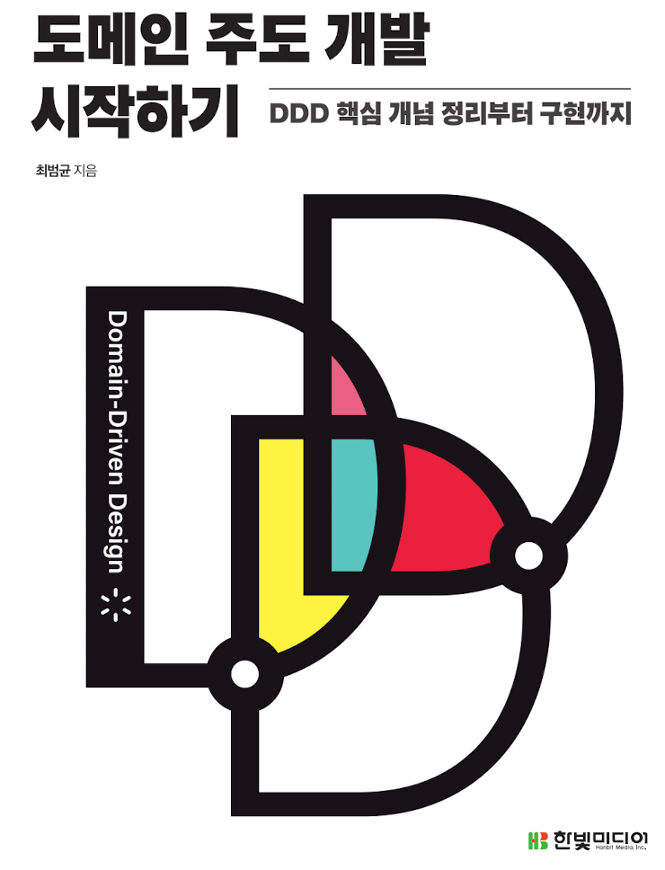
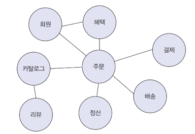

# 도메인 주도 개발(DDD)
<p align="center"></p>

## 1.도메인 모델 시작하기

> 소프으웨어로 해결하고자 하는 문제 영역 이 도메인으로 정의된다. 하나의 도메인은 하위 도메인으로 나눌 수 있으며 여러개의 하위 도메인으로 또한
> 분할 할 수 있다.

<p align="center"></p>

주문 -> 배송, 외원, 혜택 ... -> 회원 -> 혜택 -> ..

#### 1-2 도메인 전무가와 개발자 간 지식 공유

> 올바른 도메인 개발에 있어 매우 중요한 부분은 전문가(개발 의뢰자)와 개발자가 직접 소통하는것이며 때론 본인들이 실제로 원하는 것을 정확하게 표현하지 못할 때도 있다.
> 하여 왜 이런 기능이 요구 되었으며 진짜로 원하는 것을 소통하여 찾아야 한다. 이러한 방법으로 나중에 미스 커뮤니케이션에 대한 개발 착오를 줄일 수 있다.


#### 1-3 도메인 모델

> 도메인 모델에는 다양한 정의가 존재하는데 기본적으로 도메인 모델은 특정 도메인을 개념적으로 표현한 것이다.


#### 1-4 도메인 모델 패턴

> 도메인 모델 패턴이란 도메인을 구성하는 기능을 객체 지향적으로 객체에 모델링 하여 작성된 코드를 도메인 모델링이 되었다고 한다.

#### 시스템 아케텍쳐
1. 사용자 인터페이스 (표현) : 사용자의 요청을 받아 정보를 보여주는 계층.
> HTTP 요청을 응용 영역이 필요로 하는 형식으로 변환해서 응용 영역에 전달
> ex) DispatcherServlet, WebController, Filter ext...

2. 응용 : 사용자가 기능을 실행, 도메인 계층을 이용 기능을 실행함.
> 기능을 구현하기 위해 도메인 영역의 도메인 모델을 직접적으로 사용하게 된다 ex) 서비스, 핸들러

3. 시스템 제공 도메인 규칙 (도메인)
> 도메인의 핵심 모델이 구현되는 부분.

4. 인프라스트럭쳐 : 데이터베이스나 메시징 시스템과 같이 외부 시스템과의 연동을 처리
> 데이터 연동처리 또는 생성된 도메인을 DB 에 저장 메일 발송과 같은 외부와 연결이 이루어지는 부분.
> ex) JPARepository, WebClient, RestTemplate....

* [Order Domain](https://github.com/madvirus/ddd-start2/blob/main/src/main/java/com/myshop/order/command/domain/Order.java)

```text

    public void changeShippingInfo(ShippingInfo newShippingInfo) {
        verifyNotYetShipped();
        setShippingInfo(newShippingInfo);
        Events.raise(new ShippingInfoChangedEvent(number, newShippingInfo));
    }
    
    private void verifyNotYetShipped() {
        if (!isNotYetShipped())
            throw new AlreadyShippedException();
    }
    
    public boolean isNotYetShipped() {
        return state == OrderState.PAYMENT_WAITING || state == OrderState.PREPARING;
    }
```

위 코드는 주문 대기 중이거나 상품 준비중에는 배송지를 변경 할 수 있다는 도메인 규칙이 적용 되어있다. 주문 도메인 에서의 엑션 여부를 한자리에서 판단 할 
수 있을 뿐더러 핵심 규칙을 구현한 코드는 도메인에만 위치하기 때문에 규칙이 바뀌거나 규칙을 확장 해야할 경우 다른 코드에 영향을 덜 주고 변경 내역을 
모델에 반영할 수 있게 된다.

> ex) 전반적으로 도메인 객체에 대한 설명은 좋았으나 모데인 모델링 패턴에 대한 설명이 좀 부족함.

#### 1-5 도메인 모델 도출

> 도메인을 모델링할 때 기본이 되는 작업은 모델을 구성하는 핵심 구성요소 기능을 찾는것이다. 아래 예를 보자

##### <주문>

- 최소 한종류 이상의 주문을 해야한다.
- 한 상품을 한개 이상 주문할 수 있다.
- 총 주문 금액은 각 상품의 구매 가격 합을 모두 더한 금액이다.
- 출고 전에 주문을 최소할 수 없다
- 고객이 결제를 완료하기 전에는 상품을 준비하지 않는다.
- 등등...

위와같은 로직에 대한 validation 또는 규악조건들은 도메인 에 명시 되어있어야한다.
***

#### 엔티티와 밸류

- 엔티티
> 엔티티는 객체마다 고유한 식별자를 가지며 각 주문 마다 서로 다르다. 즉 내부 데이터가 변경될 경우에도 식별자는 변경되지 않으며 식별자가 같다면
> 그 객체는 같다 라고 표현할 수 있다.

- 벨류
> 벨류 타입은 엔티티 내부에서 구분 되어지는 하나의 객체 모델링이다. 예들을어 ShippingInfo 내부 배송지, 배송지명, 전화번호, 우편번호 등이 하나의 개념적
> 으로 묶여 ShippingInfo 라는 하나의 벨류를 나타내고 있다.

***불변 객체의 참조 투명성***
```text
표현식을 모두 치환해도 표현식에 변화가 없어야 함. 

@Test
@DisplayName("참조 투명한 객체")
void immutableTest() {
    String x = "Hello";
    String v1 = x + "World";
    Assertions.assertEquals("HelloWorld",v1);
}

@Test
@DisplayName("참조 투명하지 않은 객체")
void mutableTest() {
    StringBuilder x = new StringBuilder("World");
    String v1 = x.append("Hello").toString();
    System.out.println(x);
}

```

```java
public class OrderLine {
    private Product product;
    private int price;
    private int quantity;
    private int amount;
}
```
위같은 코드에서 price 에 대한 부분은 돈을 의미한다는것을 알 수 잇지만 mount 에 대한 정의가 애매할 수 있다. 하여 Money 라는 객체를 생성하여
돈에 대한 것을 관리 한다 라는 기능을 넣어줄 수 있다.
 
```java
public class Money {
    private int value;
    
    public Money add(Money money) {
        return new Money(this.value + money.value);
    }
}

public class OrderLine {
    private Product product;
    private Money price;
    private int quantity;
    private Money amount;
}
```

위와같이 코드를 작성할 경우 돈 계산을 위한 기능을 추가할 수 있다.

#### 도메인 모델에 Set 메서드 넣지 않기

> set 메서드를 사용할 경우 하나의 값이 변경 되었을때 다른 value 또한 유기적으로 변경되어야 하는경우 심각한 버그를 유발할 수 있다.
> 도메인 객체가 불완전한 상태로 사용되는 상황을 막으려면 생성자를 통해 필요한 데이터를 모두 받아야한다.

하기 필자는 Embedded 어노테이션을 사용한 코드를 많이 접해왔다. 

이글을 작성한 후에야 Embedded 에 다한 활용을 왜 해야 하는지에 대해 알게 되었다.
```text 

    public Order(OrderNo number, Orderer orderer, List<OrderLine> orderLines,
                 ShippingInfo shippingInfo, OrderState state) {
        setNumber(number);
        setOrderer(orderer);
        setOrderLines(orderLines);
        setShippingInfo(shippingInfo);
        this.state = state;
        this.orderDate = LocalDateTime.now();
        raise(new OrderPlacedEvent(number.getNumber(), orderer, orderLines, orderDate));
    }

```

#### 도메인 용어와 유비쿼터스 언어

> 코드를 작성할 때 도메인에서 사용되는 언어는 매우 중요하다. 아래와 같이 OrderStatus 를 작성했다고 가정해보자.

```java
// Before
public enum OrderStatus {
    STEP1,STEP2,STEP3,STEP4
}

//After
public enum OrderStatus {
    PAYMENT_WAITING, PREPARING, SHIPPED, DELIVERING, DELIVERY_COMPLETED
}
```

위와 같은 경우 소통의 모호함을 가져올 뿐더라 불필요한 해석 과정을 줄 수 있다.

알맞는 영어단어를 찾는 것은 쉽지 않은 일이지만 시간을 들여 찾는 노력을 반드시 해야한다. 그러니 도메인 용어에 알맞는 단어를 찾는 시간을
아까워 하지 말자.

## 2.아키텍처 개요


#### 2-2 계층 구조 아키텍처
> 보통 네 영역을 구성할때는 표현 -> 응용 -> 도메인 -> 인프라 스트럭쳐 로 가곤 하지만 때론 응용 영역에서 바로 DB 모듈 또는 외부 엔진에
> 직접적인 접근이 이뤄지기도 한다.

```text
표현 영역은 UI 또는 HTTP 메세지를 받아 응용영역에 전달하며 응용영역에서 리턴하는 HTTP 메세지를 핸들링하게 된다.
응용영역에 있는 핵심 도메인 로직은 도메인 모델 패턴으로 작성된 엔티티 또는 value 에 위임할수도있다.
```

하지만 객체간 의존성이 있는 경우 테스트 하기 어려운 단점이 존해 한다

CalculateDiscountService -> DroolsRuleEngine -> KieContainer -> KieService 

```java

public class CalculateDiscountService {
    
    private DroolsRuleEngine droolsRuleEngine;
    
    public CalculateDiscountService() {
        this.droolsRuleEngine = new DroolsRuleEngine();
    }
}

public class DroolsRuleEngine {
    ...
}

```

위와같은 위존성이 있다고 할때 CalculateDiscountService 단일 객체에 대한 테스트 하기 매우 어려워진다 어떤 객체에서 문제가 발생하는건지 연관되 어있는 모든 객체에 대한
문제를 전부 찾아야 한다.
이 문제를 해소하기 위해선 DIP 의존 역전 원칙을 이용해 구현할 수 있다.

***고수준 모듈***
> 의미 있는 기능을 제공하는 모듈

***저수준 모듈***
> 고수준의 모듈을 제공하기 위해 필요한 모듈

DIP 는 저수준 모듈이 고수준 모듈에 의존하지 않는것이며 이 코드는 추상화와 인터페이스로 해결해야한다.

```java

public class CalculateDiscountService {
    private RuleEngine ruleEngine;
    
    public CalculateDiscountService(RuleEngine ruleEngine) {
        this.ruleEngine = ruleEngine;
    }
}

public class DroolsRuleEngine implements RuleEngine{
    ...        
}

public interface RuleEngine {
    ...
}
```

위와같은 코드로 변경 될경우 CalculateDiscountService 는 저수준 모듈에 의존 하는것이 아닌 인터페이스 고수준 모듈에 의존하게 된다.

사실 스프링 프레임워크와 같은 의존성 주입 기능은 고수준 모델에 대한 의존성이 주입됨으로 Mock 프레임워크 를 이용 대역객체를 생성하여 실제 테스트 하고자
하는 타겟 고수준 모듈에 대해서만 테스트가 가능하도록 구현이 되어있다.

위와같은 경우는 Mock 프레임워크를 이용해서 대역 객체를 생성 하여 테스트 할 수 있다. 스프링 프레임워크가 아래와 같은 코드로 돌아간다고 상상해보자.

```java
public class A {
    private final C c;
    private final D d;
    public A (C c, D,d) {
        this.c = new C();
        this.d = new D();
    }
}
```

#### 2-4 도메인의 구성요소

1. Entity 

#### 2-6 인프라스트럭처 개요

> 인프라스트럭쳐는 표형,응용,도메인 영역을 지원한다. 영속성처리,트랜잭션,SMPT,REST 클라이언트등. 구현 보조기능을 지원한다.


## 에그리거트

> 애그리거트는 연관된 엔티티와 밸류 객체를 개념적으로 하나로 묶은것이다. 예를 들어 주문과 관련된 Order 엔티티 OrderLine 밸류
> 객체를 주문 에그리거트로 묶을 수 있다.

복잡한 도메인을 이해하고 관리하기 쉬운 단위로 만들려면 상위 수준에서 모델을 조망할 수 있는 방법이 필요한데 그 방법이 바로 애그리거트다.

애그리거트는 관련된 모델을 하나로 모았기 떄문에 한 애그리거트에 속한 객체는 유사하거나 동일한 라이프 사이클을 갖는다. 애그리거트에 속한 구성요소는
대부분 함께 생성하고 함께 제거된다.

#### 3-2 에그리거트 루트

> 애그리거트는 여러 객체로 구성되기 때문에 한 객체만 상태가 정상이면 안된다. 도메인 규칙을 지키려면 애그리더트에 속한 모든 객체가 정상 상태를 가져야 한다.
> 애그리거트 루트가 제공하는 메서드는 도메인 규칙에 따라 애그리거트 에 속한 객체의 일관성이 깨지지 않도록 구현 해야한다.

불필요한 중복을 피하고 애그리거트 루트를 통해서만 도메인 로직을 구현하게 만들려면 도메인 모델에 대해 다음의 두 가지를 습관적으로 적용해야 한다.
- 단순히 필드를 변경하는 set 메서드를 public 으로 만들지 않는다.
- 밸류 타입은 불변으로 구현한다.

밸류타입을 불변으로 구현하고 타입의 내부 상태를 변경하려면 애그리거트 루트를 통해서만 가능하다. 그러므로 애그리거트 루트가 도메인 규칙을 올바르게만 구현하면
애그리거트 전체의 일관성을 올바르게 유지할 수 있다.

#### 3.2.3 트랜잭션 범위

> 트랜잭션 범위는 작을수록 좋다 한 트랜잭션이 한 개 테이블을 수정하는 것과 세 개의 테이블을 수정하는 것을 비교하면 성능에서 차이가 발생한다.

한개의 트랜잭션에서는 한개의 애그리거트만 수정해야 한다. 두개 이상의 애그리거트를 수정하면 트랜잭션 충돌이 발생할 가능성이 높아진다.
한 트랜잭션에서 한 애그리거트만 수정한다는 것은 애그리거트에서 다른 애그리거트를 변경하지 않는다는 의미이다.

예를들어 배송지 정보를 변경하면 동시에 배송지 정보를 회원의 주소로 변경하는 기능이 있을경우 배송지 변경과 회원의 주소를 변경하는 로직이 하나의 트랜잭션에 존재
하면 안된다.

부득이하게 두개 이상의 애그리거트를 변경해야 한다면 응용서비스에서 각 애그리거트의 상태를 변경한다.

### 3.3 리포지토리와 애그리거트

> 애그리거트는 개념상 완전한 한 개의 도메인 모델을 표현하므로 객체의 영속성을 처리하는 리포저터리는 애그리거트 단위로 존재해야한다.
> Order 와 OrderLine 은 물리적으로 다른 DB 테이블에 저장한다고 해서 Order 와 OrderLine 을 위한 리포지터리를 각각 만들지 않는다.


***Value 와 Entity***

> 에그리거트에 속한 객체가 고유 식별자를 갖는다면 엔티티 고유 식별자를 가지지 않고 있다면 value 로 분류 된다.


#### 3.4 ID를 이용한 애그리거트 참조

> JPA 는 기본적으로 @ManyToOne , @OneToMany 와 같은 애너테이션을 이용해 연관관계 객체를 매핑한다. 하지만 필드를 이용한 참조는 다음 문제를 야기시킬 수 있다.
- 편한 탐색 오용
- 성능 이슈 (N + 1)
- 확장의 어려움

1. 편리함의 오용
> 한 애그리거트 내부에서 다른 애그리거트 객체에 접근할 수 있으면 다른 애그리거트의 상태를 쉽게 변경할 수 있게된다. 이 경우 애그리거트간의 의존도를 높여
> 결과적으로 애그리거트의 변경을 어렵게 만든다

2. 직접 참조시 성능
> N + 1 과 같은문제 또는 불필요한 쿼리 발생으로 영속성 컨텍스트에 불필요한 데이터 가 올라갈 여지가 있음.

3. 확장
> 초기에는 단일 서버에 단일 DBMS로 서비스를 제공하는 것이 가능하다. 하지만 사용자가 몰리고 서버의 분할이 이뤄질 경우 도메인별로 서비스를 분리하기 쉬워진다.

ID 참조를 사용하면 모든 객체가 참조로 연결되지 않고 한 애그리거트에 속한 객체들만 참조로 연결되게 된다. 

<br/><br/><br/><br/><br/><br/><br/><br/><br/><br/><br/><br/><br/><br/><br/><br/><br/><br/>


