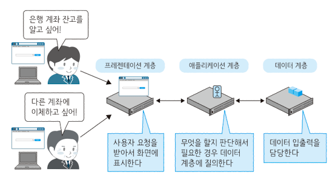
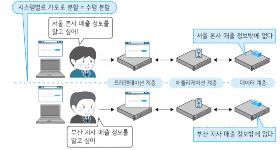
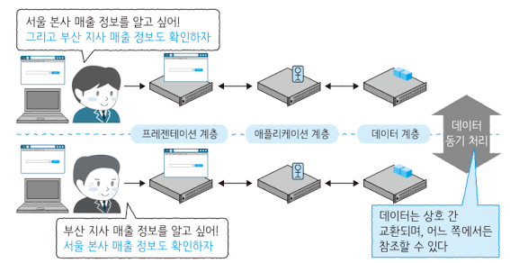
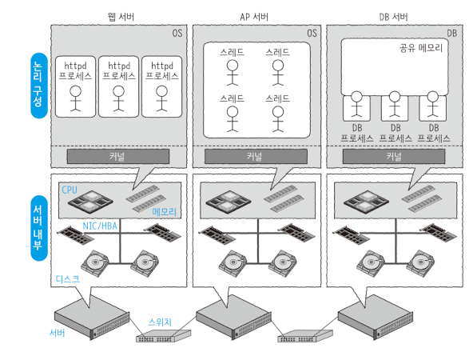
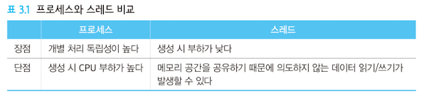
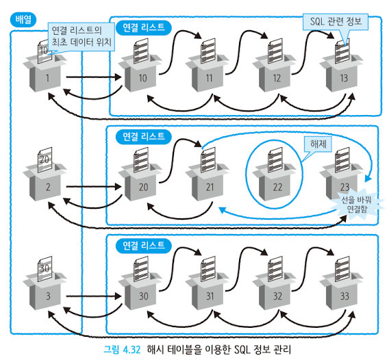
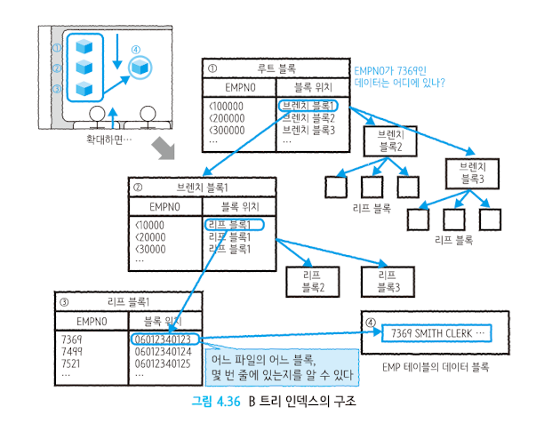

# 그림으로 공부하는 IT 인프라 구조

---
## 1. 인프라 아키텍처를 살펴보자

##### 1.1 인프라란 무엇일까
> '기반 구조' 란 뜻으로 바탕이나 토대를 의미한다. IT 인프라도 마찬가지로 어플리케이션이 동작하고 작동하고 있는 그 기반을 의미한다.

##### 1.2 집약형과 분할형 아키텍처

> IT 인프라는 컴퓨터로 구성된다. 기본적인 구성 방식에는 집약형과 분할형 이 있다.

##### 집약형

집약형 아키텍처는 하나의 컴퓨터가 모든 트레픽에 대한 핸들링을 하나의 컴퓨터가 도맡아 하는 구조를 말한다. 장점은 구성이 매우 간단하다는 장점이 있다.
하지만 하나의 컴퓨터가 모든 일을 처리 하게 되기때문에 그 컴퓨터는 멈추지 않도록 여러 고민을 해야한다.
- 방법중의 하나는 컴퓨터를 구성하는 주요 부품을 다중화 하여 하나가 고장 나더라고 업무를 계속 할 수 있도록 분리 하는것이다. 한대의 컴퓨터라고 할 지라도
그 안에 여러 컴퓨터가 같이 있는 모습이라 할 수 있다.

***장단점 정리***

장점 
1. 한 대의 대형 컴퓨터만 있으면 되므로 구성이 간단하다.
2. 대형 컴퓨터의 리소스 관리나 이중화에 의해 안정성이 높고 고성능이다.

단점
1. 도입비용과 유지 비용이 비싸다
2. 확장성에 한계가 있다.

##### 분할형

> 여러대의 컴퓨터를 조합하여 하나의 시스템을 구축하는 구조 
> 대형 컴퓨터와 비굫해서 소형 컴퓨터 구입 비용이 압도적으로 저렴하다. 단 안정성은 한대의 컴퓨터만으로 대형컴퓨터에 미치지 못한다. 분할형 아키텍쳐는 표준OS 나 개발
> 언어를 이용하기 때문에 오픈 시스템이라고도 부른다.

***장단점***

장점
1. 낮은 비용으로 시스템을 구축할 수 있다.
2. 서버 대수를 늘릴 수 있어서 확장성이 높다.

단점
1. 대수가 늘어나면 관리 구조가 복잡해진다
2. 한 대가 망가지면 영향 범위를 최소화하기 위한 구조를 검토해야 한다.

물리 서버와 논리 서버의 차이

'서버' 라고 하는 개념은 컴퓨터에서 동작하고 있는 소프트웨어를 가리크는 경우도 있고 컴퓨터 자체 하드웨어를 가르키는 경우도 있다.

논리서버 : 웹 서버, DB서버 Web Application Server

물리서버 : IA 서버, x86서버

##### 수직 분할형 아키텍처

> 클라이언트 - 서버형은 수직 분할형의 한 예이다. 물리서버는 미들웨어 데이터베이스 등의 소프트웨어를 물리 서버 상에서 운영하고 있다. 
>이들 소프트 웨어에 클라이언트 또는 단말 이라 불리는 소형 컴퓨터가 접속해서 이용하는 형대 Client/Server CS 라고 부르기도 한다.
> CS 특징은 클라이언트 측에 전용 소프트웨어를 설치해야한다는 것이다. 

장점

1. 클라이언트 측에 많은 처리를 실행할 수 있어 소수의 서버로 다수의 클라이언트를 처리할 수 있다.

단점

1. 클라이언트 츠그이 소프트웨어 정기 업데이트가 필요하다.
2. 서버 확정성에 한계가 발생할 수 있다.

##### 3계층형 아키텍처

> 프레젠테이션 계층 애플리케이션 계층 데이터 계층 3층으로 구조로 분할 되있는 구조이다.

> 프레젠테이션 계층

- 사용자의 입력을 받는다
- 웹 브라우저 화면을 표시한다

> 애플리케이션 계층

- 사용자 요청에 따라 업무를 처리한다.

> 데이터 계층

- 애플리케이션 계층의 요청에 따라 데이터를 입출력한다. 이 아키텍처는 모든 처리가 AP 서버나 DB 서버를 이용하지 않아도 된다. 이미지 파일및 정적파일
만 있으면 되는경우라면 웹서버만으로도 핸들링이 가능하다. 

장점
- 서버 부하 집중 개선
- 클라이언트 단말의 정기 업데이트가 불필요
- 처리 반환에 의한 서버 부하 저감

단점
- 구조가 CS구성보다 복잡하다.

##### 수평 분할형 아키텍처

> 수평 분할형 아키텍처는 용도가같은 서버를 늘려나가는 방식이다. 서버 대수가 늘어나면 한대가 시스템에 주는 영향력이 낮아져서 안정성이 향상된다.

단순 수평분할형 아키텍처
> 이 구성은 시스템이 둘로 분할됨으로써 시스템 전체 처리 성능을 두 배로 향상시킬 수 있다. 하지만 업데이트가 있을경우 매번 각 서버마다 업데이트를 실시해 주어야 한다.
> 서로 다른 서버 끼리 보유한 데이터도 다르기 때문에 동시에 이용할 수 없다. 주로 사용자가 있는 SNS웹 서비스에서는 사용자ID 를 기준으로 분할 하는 경우가 있다.

***장점***
- 수평으로 서버를 늘리기 떄문에 확정성이 향상된다
- 분할한 시스템이 독립적으로 운영되므로 서로 영향을 주지 않는다

***단점***
- 데이터를 일원화해서 볼 수 없다.
- 애플리케이션 업데이트는 양쪽을 동시에 해주어야한다.
- 처리량이 균등하게 분할 돼 있지 않으면 서버별 처리량에 치우침이 생긴다.

##### 공유형 아키텍처

> 서로 서버 계층간의 교환이 가능하다. 데이터 계층은 데이터 저장고의 역할도 하기 때문에 보안이 필요한 데이터가 저장되는 경우도 많다. 데이터가 각지에 흩어져
> 있는 것보다 한곳에 집중적으로 관리하는 것이 보안상 유리한 경우가 있다.

***장점***
- 수평적으로 서버를 늘리기 때문에 확장성이 향상된다.
- 분할한 시스템이 서로 다른 시스템의 데이터를 참조할 수 있다.

***단점***
- 독립성이 낮아진다
- 분할 계층간 확장성이 낮아진다

##### 지리 분할형 아키텍처

- 스텐바이형 아키텍처
> 물리 서버를 최소 두대를 준비하여 한대가 고장나면 가동중인 소프트 웨어를 다른 한대로 옮겨서 운영하는 방식이다. 이때 소프트웨어 재시작을 자동으로 하는 구조를
> 페일오버 라고한다. F/O

엑티브 스탠바이 -> 액티브 서버의 고장을 대비하여 쉬고 있는 이중화된 서버를 하나 더 배치하는 구조 이 경우 서버 고장이 없을경우 고가의 서버 자원이 놀고만 있게 된다.

## 2. 서버를 열어보자

> 서버는 Rack 이라는 것에 장착된다 랙에는 서버 이외에도 HDD 가 장착돼있는 저장소나 LAN 을 연결하기 위한 네트워크 스위치 등도 탑재돼 있다. 한 랙은 19인치 한칸에 4.5
> cm 와 같은 규격이 존재한다.

##### CPU (Central Processing Unit)

> 서버 중심에 위치해서 연산 처리를 실시한다. 명령을 받아 연산을 실행하고 그 결과를 반환한다. 명령과 데이터는 기억장치나 입출력 장치를 통해 전달된다.

##### Memory

> 메모리에 저장되는 데이터는 영구성이 없으며 서버 재시작시 휘발된다. 이런 결점에도 사용하는 이유는 CPU 에 자장되는 캐시 데이터가 너무 작아 이에 대한 커버를
> 담당한다.

##### HDD

> HDD 는 DC 나 DVD 와 같은 구조이다 이 회전 구조 떄문에 속도가 물리 법칙에 좌우 되며 메모리처럼 순식간에 액세스 할 수 없다. 이에 성능이 더 좋은 반도체 디스크
> SSD 가 등장 전기가 없어도 데이터가 사라지지 않는 구조를 갖고있다. 또한 HDD 가 많이 장착된 하드웨어를 스토리지 라고 한다. 서버와 통신시 I/O 가 발생할 경우 HDD 를 직접 참조하는것이 아닌
> 캐시를 통해 데이터를 교환한다.

##### 대역

> 대역이란 데이터 전송 능력을 말한다, 대역은 한번에 데이터를 보낼 수 있는 데이터의 폭 1초에 전송할 수 있는 횟수 x 전송 폭 으로 결정된다.

### 3계층형 시스템을 살펴보자

> 3대의 서비스는 스위치를 경유해서 연결돼 있으며 서버를 확대해서 보면 CPU 메모리 디스크 HBA 와 같은 하드웨어 부품이 나열돼 있다.

##### 프로세스와 스레드

> 프로그램을 실행하게 되면 별도의 실행 창이 열린다 이것이 프로세스나 스레드라고 불리는 것이다.
> 프로세스 및 스레드는 프로그램 실행 파일 자체가 아니라 OS상에서 실행돼어 어느 정도 족립성을 가지고 동작하는 것이다. 프로세스 및 스레드가 활동하려면 메모리 공간이 필요하다.
> OS 상에 프로세스가 로드 되면 사용자 요청을 받을 수 있게 된다. 프로세스 시작 요청이 있을경우 커널은 프로세스를 작성하여 요청 분향만큼 메모리 공간을 할당한다.
> 
> 프로그램은 서버 내부의 디스크 상에 설치가 된다. 하나의 프로세스가 동작하고 있으면 내부에서는 메모리 공간을 점유하는 스레드 하나가 동작하고 있다.
> 각 스레드는 메모리 공간을 공유하고 있으며 스레드 시작 시에 신규 메모리 공간은 필요 없지만 다른 스레드에 이상이 발생하면 영향을 받는다.
> 
> 단 프로세스간 메모리 공간을 상호 이용할 수 없는것은 아니다. 여러 프로세스가 공유 메모리 공간을 사용하게 되면 서로 데이터 교환이 가능하지만 프로세스별 독자 메모리 영역도
> 있어서 용도별로 나누어 사용한다.
>  

##### OS 커널

> OS 에서 커널은 심장이자 뇌이며 척추다. 커널이 OS 의 본질이며 나머지는 그저 덤일 뿐 이라고 해도 과언이 아니다. OS 처리는 원칙적으로는 커널을 통해 이루어진다 커널의 역할에는
> 여러가지가 있다 총 6가지 커널이 존재한다.

1. 시스템 콜 인터페이스
    - 프로세스/스레드에서 커널로 연결되는 인터페이스다 애플리케이션이 OS를 통해서 어떤 처리를 하고 싶으면 시스템 콜이라고 하는 명령을 이용해서 커널에 명령을 내린다. 
   이 명령은 시스템 콜 인터페이스로 처음 전달된다.
    - 디스크상의 데이터를 읽고 싶거나 네트워크 통신을 하고 싶을 때 또는 새로운 프로세스를 생성하고 싶은 경우에 해당 시스템 콜을 호출하면 기능을 이용할 수 있다.
    - 데이터 읽기/쓰기는 I/O 처리라고 하며 디스크 I/O 와 네트워크 I/O 와 본질적 차이는 없다. 프로세스 관점에서는 동일한 시스템 콜이다.

2. 프로세스 관리
    - 프로세스를 관리한다 OS상에서 수십 수백 수천 개의 프로세스를 가동할 수 있다. 이에 비해 CPU 코어 수는 많아야 수십개 정도밖에 안된다.
   언제 어떤 프로세스가 어느 정도의 CPU 코어를 이용할 수 있는지 처리 우선순위를 어떻게 결정 할 것인지 등을 관리하는것이 프로세스 관리의 역할이다.
   OS에 있어서 가장 중요한 기능이라고 할 수 있다.

3. 메모리 관리
    - 메모리 영역을 관리한다 프로세스 관리는 CPU 코어를 고려했지만 메모리 관리에서는 물리 메모리 공간의 최대치를 고려한다. 프로세스가 이용하는 독립 메모리 공간을 확보 하거나
   상호 간의 참조 영역을 지키기 위해 독립성을 관리하는 등의 메모리 관리 역할을 한다. 이 기능이 없으면 각 프로세스는 자신 이외의 프로세스가 사용하고 있는 메모리 영역 범위를 파악 
   해야 하므로 애플리케이션 개발자가 메모리 영역을 그때그떄 핸들링 해야한다.
   

4. 네트워크 스택

5. 파일 시스템 관리

    - 물리 디스크에 제동된 데이터를 관리하는 기능이다. 일상에서 사용하는 문서 파일 엑셀 파일 이 이에 해당한다. 기록된 데이터는 1011011011 과 같은 숫자의 집합에 불과하다.
   구분 표시도 없을 뿐더러 그대로 사용하기는 매우 어려운 형태다. 파일 시스템 덕분에 애플리케이션은 파일 이라는 단위로 데이터를 작성하거나 삭제할 수 있다.
   

6. 장치 드라이버
    - 디스크 NIC등의 물리 장치용 인터페이스를 제공한다. NIC나 디스크는 다수의 제조사가 독자 제품을 제공하고 있다. 각각에 대응하는 애플리케이션을 개발하는 것은 현실적이지
못하기 때문에 커널은 장치 드라이버를 이용해서 그 아래에 있는 물리 장치를 은폐한다. OS 에 대응하도록 커넉을 경유해 이동한다.

> 커널은 결코 견고하지 않다. 커널의 종류에는 모놀리식 커널과 마이크로 커널이다 모놀리식은 단일형을 가리키고 마이크로는 커널에서 최소한의 기능만 제공하고 그 외기능은 
> 커널 밖에서 제공한다. 모놀리식 커널은 유닉스 계열의 OS 나 리눅스, 마이크로는 애플의 맥OS 가 있다.

#### 클라이언트 PC부터 웹 서버까지

> 클라이언트 PC로 부터 웹 서버까지

1️⃣ 웹 브라우저(Chrome, FireFox..)가 요청을 발행한다.
    
- 주소창에 http://www.naver.com 을 입력하고 엔터를 친다. 이는 www.naver.com 서버에 접속한다는 의미이다.

2️⃣ 이름을 해석(Name resolution)한다. (해당사이트가 어디에 있는지 이름을 해석하여 찾아냄.)

- 웹 브라우저는 www.naver.com 의 주소를 모른다. 하여 IP 주소 변환테이블을 참조하여 존재하지 않을경우 외부의 DNS 서버의 요청을 던진다.
DNS 서버에 호스트 명이 IP 주소로 지정돼 있는것은 이때문이다. DNS 에서 조회된 IP 주소 검색 결과가 반환된다. (아직 요청은 출발하지 않았다.) 

⭐️ 아파치 에서는 기본적으로 부모 프로세스와 자식 프로세스로 나뉘어져 있다. 자식 프로세스가 HTTP 요청을 접수 한다.
응답은 HTML 파일이라는 텍스트 데이터나 이미지 동영상 등의 바이너리 데이터로 구성된다. 이 데이터 들은 정적 데이터와 동적 데이터로 분류할 수 있다.

3️⃣ 웹 서버가 요청을 접수한다.

4️⃣ 정적컨텐츠와 동적컨텐츠를 판별한다.

5️⃣ 필요한 경로로 데이터를 액세스 한다.

> 웹 서버부터 AP 서버까지 

#### 📀 웹서버부터 AP 서버까지

1️⃣ 웹서버로부터 요청이 도착한다.

2️⃣ 스레드가 요청을 받으면 자신이 계산할 수 있는지 아니면 DB 접속이 필요한지를 판단한다.

3️⃣ DB접속이 필요하면 연결 풀에 액세스 한다.

4️⃣ ~ 5️⃣ DB서버에 요청을 던진다.

#### 💽 데이터가 필요하면 DB 서버에 접속하는 것이 일반적이지만 항상 효율적일수 없다. 갱신 빈도가 낮은 정보는 캐시로 저장해 두었다가 반환하는것이 좋다

### CDN 방식

> 대부분의 웹 시스템에서는 CDN 을 이용하고 있다. 웹시스템 특징인 -> 하나의 시스템을 수많은 사용자가 이용한다 이다. 대량의 데이터 전송에 특화된 것으로
> 전 세계에 있는 데이터 복사본을 배치하는 기술과 병렬 기술을 활용해서 처리를 효율화 하고 있다.

#### 💽AP 서버로부터 DB 까지

1. AP 서버로 부터 요청이 도착한다.
- DB 프로세스가 요청을 접수한다
2. 프로세스가 요청을 접수하고 캐시가 존재하는지 확인한다.
- 이전 사용정보가 캐시에 존재하는지 확인한다.
3. 캐시가 없으면 디스크에서 데이터를 엑세스한다.
4. 디스크가 데이터를 반환한다.
5. 데이터를 캐시 형태로 저장한다.
6. 결과를 AP서버에 반환한다.

#### AP 서버부터 웹 서버까지

1. DB 서버로부터 데이터가 도착한다.
2. 스레드가 데이터를 가지고 계산 등을 한 후에 파일 데이터를 생성한다.
3. 결과를 웹 서버로 반환한다.

#### 웹 데이터의 흐름

- 프로세스나 스레드가 요청을 받는다.
- 도착한 요청을 파악해서 필요에 따라 별도 서버로 요청을 보낸다.
- 도착한 요청에 대해 응답한다.

## 가상화

> OS도 가상화 기술중 하나라고 볼 수 있다. OS 등장 이전에는 하드웨어를 의식한 프로그래밍 이 필요했고 매우 복잡한 작업이었다. OS의 커널에 의해 하드웨어가
> 추상화 되면서 데이터 교환이 하드웨어를 의식하지 않고 이루어지고 있다. OS 가 존재하지 않는 경우 하나의 프로그램에서 발생한 오류가 컴퓨터 전체를 정지시킬 가능성도 있다.
> 반대로 OS 가 있다면 가상메모리를 사용해 프로세스 및 OS 커널의 메모리 공간을 분리하므로 하나의 프로그램이 실패한다고 해도 시스템 전체에 영향을 끼치지 않는다.
> 
> ***OS위의 가상머신 위 Guest OS 를 구동하는 구조 이거나 물리 머신 바로 상위 하이퍼바이저 위에 Guest 를 동하는 구조 하이퍼 바이저 형식은 호스트 OS를 거치지 않는다.***

## 인프라를 지탱하는 기본 이론

##### 물리서버의 직렬처리와 병렬처리
- 직렬 처리로 속도를 올리는 데는 한계가 있다.
- 병렬화 를 통해 속도는 빨라지지 않지만, 단위 시간당 처리량을 늘릴 수 있다.
  - 병렬 처리에서는 합류점, 직렬화 구간, 분기점이 병목 지점이 되기 쉽다.
  - 병렬화할 때는 일을 분담해서 처리를 한 후 다시 집약할 때 오버헤드가 걸린다, 그러므로 이 오버헤드를 감안하더라도 효과가 있을 경우에 병렬화를 한다.

##### 동기/비동기 란

> 동기와 비동기의 본질은 하나의 트랜젝션이 종료될때까지 다른 작업을 지연하는것이고 비동기는 일련의 작업이 종료되기 이전에 다른작업을 시작하는 것이다.
> 
***설계 주의사항***
- 비동기로 요구한 처리가 끝나지 않은 생태에서 다음 처리를 진행해도 문제가 없는가.
- 비동기로 요구한 처리가 끝났는지 확인할 필요가 있는가.

##### 큐

> First In First Out (FIFO)  
- CPU 처리를 기다리고 있는 프로세스나 스레드 행렬
- 하드 디스크 등의 저장소 읽기 처리를 기다리고 있는 I/O 요구 행렬
- 네트워크 접속 성립을 기다리고 있는 접속 요구 행렬

##### 베타적 제어

> 동일한 리소스를 하나의 스레드가 사용할 경우 다른 스레드가 접근할 수 없도록 막는것. DBMS 의 배타적 제어에서는 매우 짧은 시간 동안만 락을 유지하는 래치
> 라는 것이 있다. 

- 복수의 처리가 공유 자원 에 동시에 액세스 하면 불일치가 발생알 수 있기 떄문에 배타적 제어로 보호해 주어야한다.
- 배타적 제어에서는 특정 처리가 공유 자원을 이용하고 있는 동안 다른 처리가 이용할 수 없게 불일치가 발생하기 않도록 한다.
- 필요 이상으로 배타적 제어를 사용하면 병렬 현상 발생으로 인한 처리 속도 저하를 야기 시킬 수 있다.

##### 배열과 연결리스트

***배열***
> 빈틈없이 순서대로 나열한것 몇번째 상자인지만 알면 해당 상자에 한번에 엑세스 할 수 있다. 검색에 대한 속도는 빠르나 추가에 대한 속도가 느리다.

***연결 리스트***
> 선으로 연결한 형태의 데이터 구조, 구체적으로 다음 상자의 위치 정보를 가지고 있다. Full Scan 순차 검색이므로 검색 속도가 느리나 데이터를 추가하는데
> 속도면에서 이점이 있다.
> 

데이터 추가 삭제가 빠른 연결 리스트와 탐색이 빠른 배열을 조합한 하이브리드형 데이터 구조가 해시 테이블이다 SQL문을 컴파일 한 후 실행해서 결과를 반환하지만
한번 실행된 SQL 관련 정보는 메모리에 저장된다, 똑같은 SQL이 실행되는 경우 처음부터 파싱하여 사용하는것이 아니라 이전 실행 시의 정보를 재사용한다.
이렇게 SQL 정보를 재사용 함으로써 CPU 사용시간을 대폭 줄일 수 있다.

##### 탐색 알고리즘

- 필요한 때에 필요한 데이터를 빠르게 찾기 위해서 데이터를 정리해 둘 필요가 있다.
- 데이터를 찾을 때의 데이터 구조와 데이터 저장방식 특성에 따라 적합한 데이터 정리 방법이 달라진다.
- 데이터 정리 방법, 처리 순서를 알고리즘 이라고 한다.
- 처리 순서에 맞추어 데이터 구조를 정리할 필요가 있기 때문에 알고리즘과 데이터 구조는 자주 함꼐 다루어진다.

인덱스가 있는 경우 색인작업이 있어 찾을때 데이터를 용이하게 찾아올 수 있음 하지만 인덱스가 있을경우 데이터 갱신, 삭제시
테이블 뿐 아니라 인덱스도 같이 갱신해야 하기떄문에 데이터 조회시는 용이하나 인서트에 대한 성능은 더 느리다.

B트리 인덱스 구조는 루트 블록에서 첫 서치 -> 브랜치 블록 -> 리프 블록 -> 최종 데이터 취득. 

##### 캐시란

> 캐시는 사용빈도가 높은 데이터를 고속으로 액세스 할 수 있는 위치에 두는것을 말한다. 일부 데이터를 데이터 출력 위치와 가까운 지점에 일시적으로 저장하며
> 데이터 재사용을 전제로 한다.

브라우저 캐시는 웹 브라우저가 접속한 페이지를 캐시한다. 이를 통해 웹 서버 접속을 중리고 브라우저 표시를 고속화 할 수 있다.
웹 서버 자체 부할를 줄이는 다른 한가지 방법으로는 웹 서버와 클라이언트 사이에 캐시 서버를 배치하는 방법이 있다. 요즘에는 캐시 서버를 서버 앞에 두는 대신에
CDN 이라는 웹 서버가 아닌 다른 네트워크에 웹 콘텐츠 캐시를 배치하는 구조를 이용하기도 한다.

캐시 이용에 대한 부적합한 사례

1. 데이터 갱신 빈도가 높은 시스템
데이터 갱신이 빈번하게 발생하는 경우는 생신 시마다 캐시해야 해서 바로 액세스 하는 경우와 차이가 없다. 

2. 대량의 데이터에 액세스 하는 시스템
데이터 액세스 시에 수백 GB 이상의 큰 데이터를 잠조하는 경우는 캐시크기도 커지며 캐시에 배치하는시간도 매우 오래걸리게 된다.

- 데이터가 실제 데이터와 캐시라는 이중 구조로 저장됙 때문에 리소스 소비가 늘어난다. 설계 시에는 어던 데이터를 캐시하는 것이 효율적인지 검토해야한다.
- 시스템 가동 직후 등에는 캐시에 데이터가 없기 때문에 원하는 성능이 나오지 않을 수 있다.
- 캐시 계층이 늘어나기 때문에 시스템 성능 문제나 데이터 불일치 문제가 발생한 경우는 문제 발생을 야기한 용의자가 늘어난다.
- 캐시으 ㅣ데이터가 손실되는 경우를 대비해서 복구 순서를 설계 시에 확립해야한다.
- 캐시할 때 캐시가 여러개 있으면 갱신된 최신 데이터를 서로 뺏으려는 상태가 발생하지 않도록 주의해야한다.

##### 끼어들기란?

> 어떤 원인으로 인해 지금 하고 있는 일을 중단하고 급히 다른 일을 하는 것을 끼어들기 라고 한다. 급한일을 먼저 하도록 CPU에 알리는 역할을 한다
> 애플리케이션이 처리를 하고 있는 동안에도 키보드를 누르면 끼어들기에 의해 문자가 입력된다. 키보드를 눌렀을떄 바로 나타나지 않는다면 이는 CPU 처리에 부하가 걸린것이다.
> 구체적으로는 키보드 입력 등의 특정 이벤트가 발생했을 떄 CPU에 이것을 알려서 해당 이벤트에 대응하는 처리를 끝낸 후 원래 하던 처리를 계속하는것이다.

##### I/O 의 크기

> I/O 크기 블록이 8KB 라 한다면 1바이트의 데이터를 읽을때고 8KB 를 읽는다. I/O 가 작을때는 블록 크기를 작게 크다면 블록 크기를 크게 해야 효율이 좋아진다.

##### 저널링

> 저널링은 트랜잭션이나 매일 갱신되는 데이터의 변경 이력을 가리킨다. 
>
- 데이터 자체가 아닌 내용을 기록한다.
- 데이터 일관성이나 일치성이 확보되면 필요 없어진다.
- 데이터 복구 시 롤백 롤포워드 에 이용된다

##### 압축

> 압축의 기본은 중복패턴 인식과 그것을 변경하는 것이다. zip 파일로 압축할 땐 크키가 작아지지만 어떤 파일은 그대로 인것을 보면 중복 패턴이 존재하지 않는다는 얘기이기도 하다.
> java 의 jar 나 war 파일도 같은 압축된 것이며 불필요한 공간을 제거해 데이터 크기를 줄이는 기술을 가리킨다.

##### OSI 7계층

1. 애플리케이션 (계층)
2. 프레젠테이션
3. 세션
4. 전송
5. 네트워크
6. 데이터 링크
7. 물리

##### 프로토콜

> 프로토콜은 어떤 잘비가 서로 통신을 하기 위해서는 프로토콜이 필요하다. PC를 마우스에 연결할떄 사용하는 USB 역시 프로토콜이다. 저장소에서 데이터를 꺼낼때 도 
> 프로토콜이 정해져있다. 대표적으로 SCSI 프로토콜이다.

##### TCP/IP

> TCP/IP 프로토콜 스위트는 명칭 그대로 TCP와 IP 두 가지 프로토콜을 주축으로 한 프로토콜 집합이다. 
> TCP 의 역할을 간단히 설명한다면 보낸 데이터를 그대로 상대방에게 확실하게 전달하는 것이다. IP 만으로도 통신이 가능하지만 나눠진 패킷에 대한 순서 또는 상대방에서
> 전달이 되었는지에 대한 기능은 TCP 가 담당하고있다. 포트 번호를 이용하여 데이터를 전송, 연결 생성, 데이터 보증과 재전송 제어, 흐름 제어와 폭주 제어 등의 역할을 한다.

##### TCP 세그먼트

> TCP 는 데이터를 세그먼트 라고 하는 단위로 관리하고 있다. 이에 애플리케이션 데이터에 TCP 헤더를 붙여서 세그먼트를 작성한다.
> 하나의 TCP 세그먼트에 넣을 수 있는 최대 크기를 MSS 라고 한다 이 예에서는 2000바이트 데이터가 1460 바이트와 나머지 540 바이트로 분할 되고 있다.
> 

##### 폭주제어

> TCP 는 어느정도의 세그먼트 수라면 수신측의 ACK 를 기다리지 않고 전송하는 윈도우의 개념을 갖고 있으며 수신 측의 윈도우와 송신 측의 폭주 송신 윈도우 
> 두가지를 오픈하여 어느 정도의 범위까지는 기다리지 않고 데이터를 전송한다. 이러한 전송 방식을 슬라이딩 윈도우 라고 한다. 
> 수신 측은 수신용 소켓 버퍼가 넘쳐서 더 이상 수신이 불가능하게 되면 수신 윈도우 크기를 작제 만들고 이 사실을 송신 측에게 알린다.
> 네트워크가 혼잡할경우 이 윈도우의 크기를 줄여 촉주를 제어하게 된다.

##### IP 계층의 프로토콜

> 지정한 대상 서버까지 전달받은 데이터를 전해 주는 것. 네트워크 통신중 가장 중요한 기능을 담당하지만 IP 에서는 반드시 전달된다고 보장하지 않는다.

커널 공간의 IP 흐름 처리는 TCP 세그먼트에 IP 헤더를 붙여서 패킷을 생성한다. 대상 서버까지는 이 IP 피킷 평태로 네트워크를 경유해서 도달한다. 

##### 라우팅

> IP 주소를 이용해 대상 서버를 지정할 수 있다 하지만 대상 서버가 다른 네트워크에 있을경우 최종 목적지까지는 라우터에 전송을 부탁하게 된다.
> IP 패킷을 받은 라우터는 해당 IP 패킷의 헤더에서 목적지를 확인해서 어디로 보내야 할지를 확인한다. 외부와 접속하는 네트워크는 보톡 기본 게이트웨이 라는 라우터가
> 설치 돼 있다. 목적지 라우터에 오류가 있어 패킷이 목적지에 가지 못하고 배회한다면 생명주기 TTL(Time To Live) 라는 생존 정로블 갖고 있다.
> 이 생존정보가 라우터를 돌면서 만료가 된다면 해당 패킷을 파기한다.

***동일한 네트워크 내의 데이터 전송***

> MAC 주소는 네트워크 통신을 하는 하드웨어 에 할당도니 주소로 원칙적으로는 세상에 있는 모든 장비가 고유한 물리 주소를 가지고 있다.
> 서버 등이 보낸 이더넷 프레임이 L2 스위치에 도착하면 프레임을 받은 L2 스위치는 MAC 주소를 보녀서 적잘한 포트에서 프레임을 꺼낸다.
> 이더넷으로 통신할 수 있는 네트워크는 동일 링크 뿐이다.

##### 안정성 및 이중화

> ToBeWrite T.T.... 클라이밍은 못참아

         

