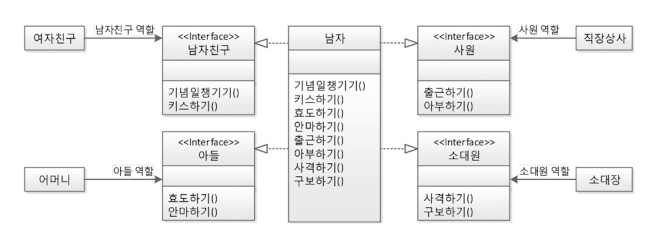

# 객체지향의 원리와 이해
<p align="center"></p>

## 01 사람을 사랑한 기술

### 어셈블리어
> 프로그래밍 언어중의 하나이며 기계어 한단계 바로 위의 언어이다. 어셈블러를 통해 기계어로 변환되어 사용된다.
어셈블리어는 고급언어와 기계어 사시에 있다하여 중간 언어 라도고 불리고있다.

### One Source Multi Use Anywhere
> OS 독립적으로 동작하며 기종별 컴파일러를 따로 구비해둘 필요가 없다

### CBD(Component Based Development)
> 애플리케이션을 통짜로 개발하지 말고 애플리케이션을 의미 있는 단위로 구분하고 그 단위를 하나 하나씩 부품으로 개발해 마치 레고 블록을 쌓아 올리듯 부품을 결합해 제품을 완성하자는 방법론.

### SOA(Service Orientec Architecture)
> 서비스 중심 구조 또는 서비스 지향 구조, 실제 현실의 업무를 기준으로 개발하는 방법론.

## 02 자바의 절차적/ 구조적 프로그래밍

### JDK, JRE, JVM

> JDK JRE JVM 을 다루기 이전 Java 프로그램의 실행에 대한 개념을 먼저 잡고가자면 JDK 컴파일 과정을 통해 생성된 .class 파일이 JVM 에 로드되어 바이트 코드를 해석 하여 메모리 등의
> 리소스를 할당 관리하면서 정보를 처리하는 일련위 작업을 말한다.

- JDK (Java Development Kit) 는 자바 가상머신(JVM, JRE) 와 함께 프로그래밍에 사용되는 3대 핵심 기술 패키지 가운데 하나이다. 쉽게 말해 JVM 과 JRE 에 의해 실행되고
구동될 수 있는 자바 프로그램을 생성할 수 있게 해준다. 하여 JDK 의 범주는 JRE 와 JVM 모두를 포함하는 범주로 분류되며 독립적으로 존재할시 그 자체로 작성된 코드를 실행시켜볼 수 없을 것이다.

 <p align="center"></p>


- JRE 는 JDK 에서 개발된 프로그램을 클래스 로더를 거쳐 만들어진 .class 파일들의 바이트 코드를 JVM 을 거쳐 실제 구동될 수있는 환경을 제공하는 영역으로 정리될 수 있다.
- JVM 은 스택기반의 자바 가상머신 (Java Virtual Machine) 으로 클래스 로더로부터 읽어온 바이트코드를 실제 실행하는 머신이다. 총 5가지의 큰 범주로 분리 되며 
  PC Register (Area), Stack, Native method stack, Method Area, Heap  
    ##### PC Register
    - 프로그램의 실행은 CPU 에서 명령어 즉 instruction (연산지시자) 을 수행하는 과정으로 이루어진다. 이러한 instruction 을 수행하는 동안 필요한 정보를 레지스터 라고 하는데 CPU내의 기억장치를 이용한다.
      > 1 + 2 라는 연산을 수행하는 경우 연산에 필요한 데이터 1, 2, + 연산이 있다. 연산을 수행하다보면 1이라는값과 2라는 값을 받은 후 이 숫자를 더한 결과값을 내는 과정으로 진행된다.
       1과 2처럼 명령에 실행되는 데이터를 Operand(피연산자) 라 하며 더하기 연산 명령과 같은 instruction 도 존재한다. CPU 는 이 모든것을 기억하고 있어야 연산과정을 처리 할 수 있으며
       3이라는 Operand 도 처리 결과를 메모리로 전송해야 하기 때문에 어딘가에 잠시 머물러야 한다. 이떄 사용되는것이 CPU 레지스터 이다.
       하지만 JVM 의 PC register 영역은 CPU 에 직접 연산지시자를 수행하지 않고 Stack 영역에서 피연산자를 별도로 뽑아 메모리 공간에 저장하는 방식을 취하는데 이를 PC Register 가 관할한다.
    - 자바는 플랫폼에 독립적이기는 하나 OS나 CPU 의 입장에서 보면 하나의 프로세스에 지나지 않기 때문에 머신의 리소스를 사용한다. 
    - PCRegister Thread 마다 하나씩 존재하며 CPU 로 보내는 Instruction 을 제공하기전 버퍼공간으로 활용하게 된다.
    
    ##### Stack (Area)
    - 기본 자료형 primitive 에 해당되는 지역변수가 저장되는 공간이다. 해당 메소드 호출될 때 메모리에 할당되고 종료되면 메모리가 해제되는 구조이다. 
    - 원시타입의경우 참조값을 저장하는것이 아니라 실제 stack 에 값이 저장된다.
    - 커스텀 오브젝트 Heap 영역에 할당관 데이터의 참조값이 할당된다.
      <p align="center"></p>
        <br>
      <p align="center"></p>
      Stack 영역의 변수는 scope 를 갖고 있으며 해당 영역이 소진되지 않고 쌓이는 로직만 계속 된다면 스텍영역넘침 현상 StackOverFlow Exception 이 발생한다.
    
    ##### Heap
    - Heap 영역은 Instance(Object) 와 Array 객체 단 두가지 종류만 저장되는 공간이며 모든 Thread 에 의해 공유되는 영역이다.
    - 애플리케이션 내 Thread 사이에서 공유된 Heap 영역 데이터를 이용할 경우 동기화 이슈가 발생할 수 있다.
    - Heap 메모리의 해제는 오로지 ***G.C*** 를 통해서만 수행되게 된다. [참조: JVM 메모리 구조](https://12bme.tistory.com/382) <br>
    ***위 정리된 자료 추후 다시 읽어보기***
    
    ##### Method, Class, Static 영역
    - 클래스 로더에 의해 바이트 코트로 분류된 데이터가 로드 되는 영역이다. 메소드 뿐만 아니라 static 변수도 이에 포함된다.
    - 이또한 Thread 별로 생성되는것이 아니라 모든 Thread 의전역적 접근이 가능하.
    
    ##### Native Method
    - 일반적인 메소드가 실행되는경우 Stack 영역에 적재가 되지만 Native 키워드가 붙은 native 메소드가 실행될 경우 이 영역에 할당되게 된다.

### 절차적/구조적 프로그래밍의 유산

```java
public class Start{

    public static void main(String[] args) {
        System.out.println("Hello World");
    }
}
```

> 위 코드가 실행될때 일어나는 과정을 메모리 관점에서 바라보도록 하자
1. class, Method 영역에 java.lang 패키지가 로드 된다. 모든 자바프로그램이 시작할때 반드시 로드 되는 패키지이다.
2. Start 클래스가 Class 영역에 로드된다.
3. main() 메서드가 호출되기 때문에 Stack 영역에 할당된다.
4. main 함수는 args 라는 파라미터를 받아 args 변수 또한 stack 영역에 할당된다.
5. 이후 println() 구문이 실행되면서 GPU 화면 출력 명령 전달
6. 스텍영역의 데이터 소멸 JVM 을 종료한후 JRE 영역또한 메모리에서 사라진다.

##### 멀티 스레드/ 멀티 프로세스의 이해

***멀티스레드의 개념은 스택영역을 스레드 개수만큼 분할해서 쓰는 것이다.***
> 스테틱 (Class, Method, Static) 영역과 힙 영역은 공유 되며 스텍 데이터 처리를 멀티 소팅이 이뤄진다.
- Servlet 을 예로 들었을 경우 하나의 요청당 하나의 프로세스가 아닌 하나의 쓰레드를 생성한다. 따라서 멀티 프로세스 대비 메모리를 적게 사용할 수 있는 구조이다.
- 


***멀티프로세스의 개념은 다수의 스태틱,스택,힙 영역의 메모리 구조를 갖는것이다***
> 서로 static, stack, heap 영역을 공유하지 않는다.
- 서로 메모리 영역을 침범하지 않는 안전한 구조이지만 메모리 사용량은 그만큼 크다.
 

> 객체지향 프로그래밍은 절차지향 프로그래밍의 유산을 간직하고 있으며 연산자 제어문 메모리 관리 체계 등등 많은 부분을 차용하고 있다. 객체 지향 프로그래밍도 
> 메서드 작성에 대한 지혜를 구조/절차적 프로그래밍에서 배워와야한다. 

## 03. 자바와 객체 지향

> 기계 종속적인 개발을 탈피하여 현실 세계처럼 프로그래밍을 할 수는 없을까 하는 고민 속에서 객체 지향의 개념이 탄생했다.
<br>

***객체와 클래스의 차이 실존(세상에 유일무이)하면 클래스 그것이 아니라면 객체이다***

객체: 사람, 새, 전자제품

클래스: SamsungGalaxyS5, 얀센백신, 스프링 입문을 위한 자바 객체 지향의 원리와 이해 도서


### 객체 지향의 4대 특성 

1. 캡슐화
> 자바는 캡슐화의 수간으로 private, public, default, protected 의 키워드를 이용하여 접근을 제한한다. 자 입부분에서 변수를 선언했을때 private default 라는 키워드로
외부에서의 직접접근을 막았다고 해서 이 객체는 캡슐화가 되었고 정보은닉이 되었다고 할 수 있을까? 답은 아니다.

### 캡슐화 vs 정보은닉
> 이 두컨셉은 같은개념이 아니다. 캡슐화는 클래스 내 프로퍼티와 메소드의 구현을 래핑하여 인터페이스를 통해서만 해당 클래스를 컨트롤 할 수 있도록 만들어 놓는것이다.
자판기를 예를들며 돈을 넣고 버튼하나만 누르면 음료수가 나오게 되어있다 내부에서 동전이 유효한지 어떤 프로세스를 통해 내가 코카콜라를 나오게 하는지 클라이언트는 모르게
해당 기능과 정보가 은닉되어있는것이다. <br> 
 <br>
***캡슐화의 추구 방향:복잡한 로직과 데이터를 래핑하여 특정 인터페이스를 통해서만 소통을 하는것에 초점을 둠 하여 반드시 private 데이터만 다루는 것은 아니다.***<br>
***정보은닉의 추구 방향: 다른 객체가 특정 클래스 멤버에 액세스하는 것을 방지하는것. 은닉대상 데이터는 반드시 private 으로 선언한다.***<br>

Reference : [Difference Between Data Hiding and Encapsulation](https://techdifferences.com/difference-between-data-hiding-and-encapsulation.html#ComparisonChart)

2. 상속
> 객체의 상속은 부모와 자식의 관계의 관점으로 바라보는것이 아닌 상위와 하위, 슈퍼와 서브의 관점으로 바라봐야한다. 사람 -> 강호동, 표유류 -> 고래, 박쥐, 소, 말 조류 -> 참새, 독수리
```java
public class Test{

    public static void main(String[] args) {
        Animal animal1 = new 참새();
        Animal animal2 = new 독수리();
        Animal animal3 = new 고래();
        Animal animal4 = new 소();
        Animal animal5 = new 쥐();
    }
}
```
- 위와같이 상속의 개념은 상위클래스가 하위클래스에게 자원을 물려주는것이 아니다. 공통된 기능과 자원을 추상화한 데이터 를 가지며 하위 클래스는 공통 자원을 활용할 수 있다. 
모든 클래스는 Object 를 상속하고 있다 이에 모든 클래스는 toString() 이라는 메소드를 전역에서 사용할 수 있다.

- 상속은 is a kind of 관계를 만족해야 한다
  - 강호동은 사람중 하나이다. (O)
  - 컴퓨터는 가전제품중 하나이다. (O)
  - 아들은 아버지중 하나이다. (X)

> 서브 클래스를 인스턴스화 하여 Heap 메모리에 데이터를 로드 했을경우 슈퍼 클래스도 같이 Heap 메모리에 로드되게 된다. 

```java
public abstract class Animal{
    protected String name;
    
    public void showName(){
        System.out.println(name);
    }
}
public class Cow extends Animal{
    
    private String habit;
    
    public Cow(String habit){
        this.habit=habit;
    }
    public void showHabit(){
        
    }
}
public class Main{
    public static void main(String[] args) {
        Cow cow = new Cow("긁기");
        cow.showName();
        cow.showHabit();
    }
}
```
위 코드에서 Cow 의 인스턴스 cow 가 Stack 영역에 생성 Heap 영역에 new Cow() 의 데이터가 올라감과 동시에 그 슈퍼클래스인 Animal 또한 같이 올라가게 된다.


***업캐스팅과 다운케스팅***
>업캐스팅: 자바에서 서브 클래스는 수퍼클래스의 모든 특성을 상속받는다. 그렇기때문에 서브클래스는 슈퍼클래스로 취급될 수 있다.
 서브클래스가 슈퍼클래스로 형변환되는 형태 -> 업캐스팅 상속관계에서 비명시적 형변환이 이뤄진다.
 ex) Object object = new String();
 이때 object 는 String Class 가 갖고있는 자원을 위 코드작성만으로 사용할 수 있을까? 답은 사용할 수 없다. 그에 대한 이유는 런타임 영역에 할당되었을 경우 object 의 타입은 
 그저 Object 인것이다. 어떤 값이 들어가건말건 Runtime 시에 어떤 클래스로 선언이 되었는가 만을 고려하게 된다. Object class 에 String 이 갖고있는 split(), toLowerCase() 메소드가
 존재하는가? 그렇지 않다. 자바에서 서브 클래스는 슈퍼클래스의 모든 특성을 상속받지만 슈퍼 클래스가 서브 클래스의 자원을 상속받지 않는다.
 하여 toLowerCase 호출시 Object 의 super 타입에서 toLowerCase 를 찾게된다. 있을리 만무하다.

- 업캐스팅된 객체에서 서브클래스의 자원을 활용하고 싶다면 ***다운캐스팅(슈퍼클래스가 서브클래스로 형변환 되는 형태)*** 을 해주어야한다.

```java
(String(object)).toLowerCase();
```

3. 추상화
> 추상화는 곧 모델링이다. 구체적인 것을 분리해서 관심 영역에 대한 특성만을 가지고 재조합하는 것이며 사물을 복제하는것이 아니라 비즈니스 로직, 목적에 맞게 관심있는
> 특성만을 추출해서 표현하는것이다.
- 자바는 객체 지향의 추상화를 class 키워드로 지원하고 있다. interface, abstract

4. 다형성
> 다형성의 가장 큰 특성은 Overriding 과 Overloading 이라고 할 수 있다. 슈퍼클래스와 서브클래스 의 기능 재정의, 같은 이름의 메서드 다른 인자의 중복정의등
- Overriding -> 상위 클래스의 메서드 재정의
- Overloading -> 같은 이름의 메서드 다른인자의 중복정의.

#### 정적메서드의 사용
> 정적메서드는 객체의 존재 여부와 관계없이 JVM 구동시 static 영역에 로드되기때문에 주로 유틸리티성 메서드를 주로 사용하게 된다.

#### Call by Value , Call by Reference

> Call By Value 와 Call by Reference 는 본질적으로 차이가 없다. 다만 기본 자료형 변수(primitive Type)라면 저장하고 있는 값 자체로 해석하는 반면
참조형 변수 Reference Type 은 저장하고 있는 주소값을 해석한다. 두 개념의 공통점은 갖고있는 값을 그대로 복사해 넘겨준다는 개념은 동일하다.

##### 자바는 어떤 방식을 유지할까?
> 자바는 확실하게 Call By Value 를 사용한다.

자바는 메서드 호출시 사용되는 인자(파라미터)의 값을 복사해서 보낸다. 즉 전달받은 값을 복사하여 복사본을 변경하여도 원본은 변경되지 않는다 이다.

```java
int a = 20;
int b = a;
b = 30;
```
1. 위 코드에서 b = 30 으로 변경 되었고 a 까지 30으로 변경되었을거라고 생각하는 Java 개발자는 없을것이다.Primitive 타입에서 a 는 주소값이 아닌 값을 복사하여 b 변수에 넘겨주게 된다

---

```java

Person a = new Person();
a.name = "Patrick";
a.age = 100;

Person b = a;
b.name = "Camilla"
```

2. 위 코드에서 a 는 Reference 타입의 객체를 생성하고 그 데이터를 a 에 담았다. 그 후 a -> b 에 담고 b 의 데이터를 바꾸면 모두가 알다시피 a 의 값이 변경되었다.
a.name -> Camila b.name -> Camila 이러면 Call by Reference 가 아닌가 할 수 있지만 아래 코드를 살펴보자

```java

Person a = new Person();
a.name = "Patrick";
a.age = 100;

Person b = a;
b = null;
```

위 코드에서 과연 a 값 또한 null 이 되었을까 ? 그렇지 않다 b 만 null 값으로 출력 되었을것이다. 위 코드에서 모두 name 이 Camilla 로 변경된 것은 변수 a 가 
갖고 있는 실체 참조 주소값을 복사하여 b 에 넘겨줬기때문에 발생한 현상이다. 어차피 주소값을 복사한다 한들 같은 Heap 영역에 생성된 객체를 참조 하고 있다면 하나를
변경했을때 참조하고 있는 값이 변경되는것은 당연하다.

***다시 말하지만 Java에서 Primitive Type 은 Call By Value, Reference 타입은 Call by Reference 다 는 🐶소리다 자바는 Call by Value 이다.***

## 04 자바가 확장한 객체 지향

##### abstract 추상메서드의 사용

1. 추상클래스는 인스턴스 즉 객체를 만들 수 없다 new 를 사용할 수 없다
- 에초에 new 를 이용해 생성하려는 목적이 아니라 공통된 기능과 속성을 추상화하여 서브 클래스가 상속하는 구조로 설계 해야 하기때문에 new 를 사용하는것 자체가 OOP 위배이다.
2. abstract 메서드는 구현을 강제한다.
3. 추상 메서드는 추상 클래스 내부에 있어야한다.

##### static 블록

```java
public class Person{
    static {
        System.out.println("첫 인스턴스");
    }
}
```
> 정적 속성을 사용할때, 정적 메서드를 사용할때, 클래스의 인스턴스를 최초로 만들었을때 최초소 static 영역에 한번 로드된후 이후 호출시에는 static 영역에 올라간
> 데이터를 공유한다. 처음 프로그램이 기동될때 올라가지 않는 이유는 스테틱도 메모리 영역이기때문에 최대한 늦게 로드되도록 설계된것이다.

##### instanceof

> instanceOf 연산자가 보인다면 냄새나는코드가 아닌지 리펙터링의 대상이 아닌지 점검해 봐야한다.

##### this

- 지역변수와 속성의 이름이 같은 경우 지역변수가 우선한다.
- 객체 변수와 이름이 같은 지역변수가 있는 경우 객체 변수를 사용하려면 this 를 접두사로 사용한다.
this.name; this.age
- 정적변수와 이름이 같은 지역변수가 있을 경우 정적 변수 이용시 클래스명을 접두사로 사용한다.
Person.name Member.age ...


## 05 객체 지향 설계 5원칙 - SOLID

> SOLID 는 Robert C. Martin 이 2000년대 초반 객체 지향 프로그래밍 및 설계의 다섯 가지 기본 원칙으로 제시한것을 마이클 페더스 가 두문자어로 소개한 것이다.

좋은 소프트웨어 설계를 위해서는 결합도는 낮추고 응집도는 높이는것이 바람직하다. 상호 객체간의 결합도는 낮추며 하나의 내부 모듈 안에는 높은 응집도로 
단일책임 과 독립성을 높여 수정 유지보수가 용이하도록 설계한다.

- ***SPR(Single Responsibility Principle) 단일 책임 원칙***

> 어떤 클래스를 변경해야 하는 이유는 오직 하나뿐이어야 한다. 이 말은 특정 기능을 수정할때 클래스 단 하나만 수정하면 되도록 설계해야 된다는 뜻이다.

***하나의 클래스에 메서드가 3개 있으면 3개 책임인것인가?***

그렇지 않다. 하나의 객체가 여러가지의 메소드 기능을 갖고있어도 하나의 목적을 바라보고 작성된 코드라고 한다면 단일책임 원칙을 지켰다고 볼 수 있다.

 

위와같은 경우 하나의 객체에 의존하는 서브 클래스들이 너무 많이 존재한다. 여자친구 객체는 남자의 사격하기와 구보하기 출근하기 등의 메소드를 상속받아
사용할 필요가 없다.

단일 책임 원칙은 객체의 상호 의존관계에만 국한되지 않으며 속성, 메서드, 패키지, 모듈, 컴포넌트, 프레임워크 모든 설계에 적용될 수 있는 개념이다.

```java
public class Main {

    public static void main(String[] args) {
        사람 로미오 = new 사람();
        사람 쥴리엘 = new 사람();
        줄리엣.군번 = ?????;
    }
    
    ...
    public static class 사람{
        String 군번;
    }
}
```
위와같이 줄리엣이 가진 군번 속성에 값을 할당하거나 읽어 오는 코드를 제제할 방법이 없다. 

```java
public class Main {

    public static void main(String[] args) {
        사람 로미오 = new 사람();
        사람 쥴리엘 = new 사람();
    }
    
    ...
    
    public static abstract class 남자 implements 사람{
        String 군번;
        ...
    } 
    
    public static abstract class 여자 implements 사람{
        Integer 화장품수;
        ...
    }
    
    public interface class 사람{
        String name;
        Integer age;
    }
}
```
위와같이 변경할 경우 코드에는 아무런 변경없이 향기나는 리펙토링이 완성된다.

단일 책임이 정상적으로 지켜지지 않았을 경우 나타나는 징조가 대표적으로 if문의 분기처리이다.

```java
if(serviceCategory == 세차){
        //세차로직
} else if(serviceCategory == 충전){
        //충전로직
}
```
위의 메소드는 세차와 충전 두가지를 처리하는 일을 도맡아 해야한다 이경우 
세차에 대한 비즈니스 로직이 수정되었을경우 충전 로직에도 영향을 충분히 줄 수 있다.
---

- ***OCP(Open Closed Principle) 개방 폐쇄 원칙***
> 소프트웨어 엔티티는 확장에 대해서는 열려있어야 하지만 변경에 대해서는 닫혀 있어야 한다 - 로버트 C.마틴

기능이 변하면 확장가능하지만 해당 기능의 코드는 수정하면 안된다는 뜻이다. 만약 객체 하나를 수정한다고 가정한다면 해당 객체를 의존하고 있는 다른 객체들이
수정에 줄빠따 맞듯이 바뀌어야되면 안된다는 뜻이다.

데이터베이스 프로그래밍을 경험한적이 있다면 개방 폐쇄 원칙의 아주 좋은 예를 들 수 있다. JDBC 를 사용하는 클라이언트는 데이터베이스가 Oracle 에서 Mysql로 바뀌더라도
Connection 을 설정하는 부분 이외에는 따로 수정할 필요가 없다. JDBC 인터페이스라고 하는 완충 장치로 인해 변화에 영향을 받지 않기때문이다.

다른 예로 JVM 또한 개방 폐쇄 원칙을 따르고 있다 자바 소스코드는 OS 독립적으로 에플리케이션이 구동되도록 환경을 제공한다. 운영체제 변화에는 닫혀있고 운영체제별 JVM 확장에는 열려있는것이다.

> 개방폐쇄 원칙이 적용되지 않았을경우 아래와같이 if 문이 줄줄이 늘어날 것이다

```java
if(jdbcType == ORACLE){
    Oracle oracle = new OracleDriver();
}

if(jdbcType == MySQL){
    MySQL mysql = new MySQL();
}
        ...
```

> 개방 폐쇄 원칙 적용후

```java
public enum JDBCType {
    ORACLE,
    MYSQL,
    MSSQL,
}

public interface JDBCInterface {
    void execute();
}

public class Oracle extends JDBCInterface {

    public void execute() {
        System.out.println("OracleLogic");
    }
}

public class MySQL extends JDBCInterface {

    public void execute() {
        System.out.println("MySQLLogic");
    }
}
...

public class JDBCHandlerFactory {

    HashMap<JDBCType, JDBCInterface> jdbcInterfaceHashMap = new HashMap<>();

    public JDBCHandlerFactory() {
        jdbcInterfaceHashMap.put(JDBCType.ORACLE, new Oracle());
        jdbcInterfaceHashMap.put(JDBCType.MYSQL, new MySQL());
    }

    public JDBCInterface getOneByJDBCType(JDBCType jdbcType) {
        return jdbcInterfaceHashMap.get(jdbcType);
    }
}

public class Main {

    public static void main(String[] args) {
        JDBCType jdbcType = ...
        JDBCHandlerFactory jdbcHandlerFactory = new JDBCHandlerFactory();
        JDBCInterface jdbcInterface = jdbcHandlerFactory.getOneByJDBCType(jdbcType);
        jdbcInterface ...
    }
}
```
> 인터페이스의 완충작용으로 객체를 사용하는측 Client 함수에서는 몇개의 데이터 베이스가 사용될지라도 코드 변화가 없다.

- LSP(Liskov Substitution Principle) 리스코프 치환 원칙

> 서브타입은 언제나 자신의 기반 타입으로 교체할 수 있어야한다.
1. 하위 분류는 상위 분류의 한 종류이다.
2. 수현 분류는 인터페이스화 할 수 있어야한다.

리스코프 치환 원칙은 상속의 법칙 is a kind of 법칙에 위배되지 말아야한다.
아버지 춘향이 = new 딸();

상속의 개념으로 보면 말이 되보이지만 딸 은 아버지의 한 종류이다 ? 와 같은 망측한 말이 되어버린다.

전자제품 컴퓨터 = new 컴퓨터();

컴퓨터 는 전자제품의 한 종류이다 와 같은 아주 단순한 논리로 접근해야한다.


- ISP(Interface Segregation Principle) 인터페이스 분리 원칙

> 클라이언트는 자신이 사용하지 않는 메서드에 의존 관계를 맺으면 안된다.

단일책임 원칙에서 덩어리가 크며 의존성이 높은 객체를 다수의 클래스로 토막내어 사용하였다. 이처럼 SRP 처럼 토막내어 사용할 수 없다면 인터페이스 
분할 원칙을 사용할 수 있다. SRP와 ISP 는 같은문제에 대한 두 가지 다른해결책이라고 볼 수 있다. 

***코드 예시를 살펴보자***
```java

/*public interface WashService{
    void wash();
    void visit();
    void detailWash();
}*/

public class Auton implements WashService, AutonWash{
    @Override
    public void wash(){
        System.out.println("외부 세차");
    }
    @Override
    public void visit(){
        System.out.println("방문");
    }
    @Override
    public void detailWash(){
        System.out.println("내부 세차");
    }
}

public class InstaWash implements WashService , InstaWashFunc{
    @Override
    public void wash(){
        System.out.println("외부 세차");
    }
    @Override
    public void visit(){
        System.out.println("방문");
    }
    /*@Override // 인스타 워시는 내부 세차를 하지 않고 타이어 세차를 해야한다면? 
    public void detailWash(){
        System.out.println("내부 세차");
    }    */
    @Override
    public void void wheelClean(){
        System.out.println("바퀴 청소");
    }
}

public interface WashService{
    void wash();
    void visit();
}
public interface AutonWash{
    void detailWash();
}

public interface InstaWashFunc(){
    void wheelClean();
} 

```
> 자 위와같은 코드로 Auton 이라는 서비스를 구현해볼 수 있다. 하지만 여기서 서비스가 하나가 더 추가 되었다 위 서비스는 내부 세차 서비스를 제공하지 않는다.
이 경우 구현해 놓은 인터페이스를 빈칸으로 둘 수 있겠지만 새로 들어오는 서비스 들이 각기 다른 서비스를 요구 한다면 1개의 인터페이스로는 소화하기 어려울 것이다.
이 경우 인터페이스를 분리하는 기법이 사용될 수 있다.



> 불필요한 다운캐스팅을 피하기 위해서는 빈약한 상위클래스보다 풍성한 상위 클래스를 이용하자.

- DIP(Dependency Inversion Principle) 의존 역전 원칙

1. 고차원 모듈은 저차원 모듈에 의존하면 안 된다.
2. 두 모듈 모두 다른 추상화된 것에 의존해야한다.
3. 추상화된 것은 구체적인 것에 의존하면 안된다.
4. 구체적인 것이 추상화된 것에 의존해야 한다.

***5. 자주 변경되는 구현체에 의존하지 마라.***

DIP 의 핵심 개념은 자신보다 변하기 쉬운 것에 의존하지 마라 이다. 변하기 쉬운 것에 의존하던 것을 추상화된 인터페이스나 상위 클래스르 두어 변하기 쉬운 것의
변화에 영향받지 않게 하는것이다.

##### SoC (Separation of Concerns)

> 관심이 같은것끼리는 하나의 객체 안으로 또는 친한 객체로 모으고 관심이 다른것은 가능한 한 따로 떨어져 서로 영향을 주지 않도록 분리하라는것이다. 
SoC 를 적용하였을때 SRP, ISP, OCP 에 도달하게 된다.
SOLID 원칙을 적용하면 소스 파일의 개수는 더 많아지는 경향이 있다. 하지만 이렇게 많아진 파일이 논리를 더욱 잘 분할하고 잘 표한하기에 이해하기 쉽고 개발하기 쉬우며 유지와 관리
> 보수하기 쉬운 소스가 만들어진다.


## 06 스프링이 사랑한 디자인 패턴

1. 어댑터 패턴
> 어댑터 패턴의 역할은 서로다른 두 인터페이스간 통신이 가능하게 하는것이다.

[어뎁터 패턴 예제](../src/test/java/me/patrick/laboratory/assume/AssumptionsTest.java)


### 저자 추천사항
- 어셈블리어 서적을 1권을이라도 읽어보라.
- Head First Design Patterns
- 토비의 스프링 3.1
- 도메인 주도 설계란 무엇인가?
- 도메인 주도 설계


</br></br></br></br></br></br></br></br></br></br></br></br></br></br></br></br></br></br></br></br></br></br></br></br>